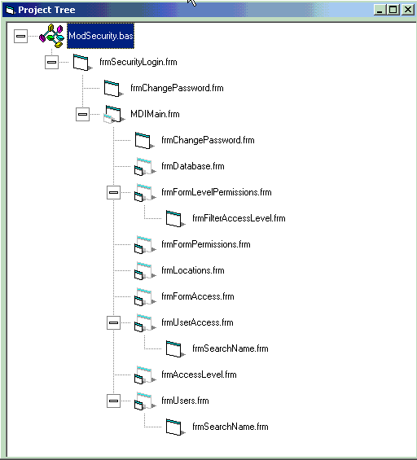



## VBP Project Map

### Description

I recently started working on a huge Visual basic program (150+ forms). I needed a quick way to find what was calling what. After not finding anything, I made this. It basically loops through the vbp, frm and bas files to develop a relationship of forms in a tree control. Beware, there is some spaghetti in this app. Enjoy!
 
### More Info
 
Visual Basic VBP file, and all associated frm and bas files.

Tree view of application form calls and a text file output of the map.

             |
---                |---
**Submitted On**   |2002-08-13 16:55:32
**By**             |[Andrew  Sutherland](https://github.com/Planet-Source-Code/PSCIndex/blob/master/ByAuthor/andrew-sutherland.md)
**Level**          |Intermediate
**User Rating**    |4.6 (41 globes from 9 users)
**Compatibility**  |VB 5\.0, VB 6\.0
**Category**       |[Files/ File Controls/ Input/ Output](https://github.com/Planet-Source-Code/PSCIndex/blob/master/ByCategory/files-file-controls-input-output__1-3.md)
**World**          |[Visual Basic](https://github.com/Planet-Source-Code/PSCIndex/blob/master/ByWorld/visual-basic.md)
**Archive File**   |[VBP\_Projec1179748142002\.zip](https://github.com/Planet-Source-Code/andrew-sutherland-vbp-project-map__1-37939/archive/master.zip)

